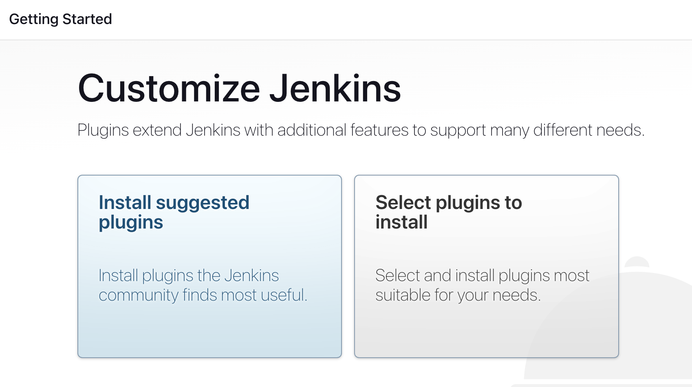

# Instructivo de instalación

## Instalación base de Jenkins
Decidimos correr Jenkins dentro de un contenedor de Docker. Sin embargo, en el futuro vamos a querer correr agentes Docker *dentro* del contenedor de Jenkins. Ahí es donde entra en juego Docker-in-Docker (DinD), que permite que el contenedor de Jenkins pueda levantar contenedores por sí mismo.

Para realizar la instalación base seguimos la [documentación oficial](https://www.jenkins.io/doc/book/installing/docker/).

Primero debemos crear una imágen personalizada de jenkins-blueocean que tenga Docker instalado dentro. De esta manera, podremos correr comandos de Docker dentro del contenedor de Jenkins.

### Dockerfile
```
FROM jenkins/jenkins:2.387.3
USER root
RUN apt-get update && apt-get install -y lsb-release
RUN curl -fsSLo /usr/share/keyrings/docker-archive-keyring.asc \
  https://download.docker.com/linux/debian/gpg
RUN echo "deb [arch=$(dpkg --print-architecture) \
  signed-by=/usr/share/keyrings/docker-archive-keyring.asc] \
  https://download.docker.com/linux/debian \
  $(lsb_release -cs) stable" > /etc/apt/sources.list.d/docker.list
RUN apt-get update && apt-get install -y docker-ce-cli
USER jenkins
RUN jenkins-plugin-cli --plugins "blueocean docker-workflow"
```

Luego creamos un docker-compose.yml, donde vamos a configurar:
- Una red `jenkins`, donde estarán alojados los contenedores `jenkins-blueocean` y `jenkins-docker`, que corren la instancia de Jenkins y DinD respectivamente.
- El volúmen `jenkins-data`, que albergará los datos y configuraciones de nuestra instancia de Jenkins
- El volúmen `docker-certs`, que albergará los certificados TLS que usaremos para verificarnos cuando querramos correr comandos usando DinD
- `jenkins-blueocean`, el contenedor que albergará la instancia de Jenkins
- `jenkins-docker`, el contenedor que albergará el servicio de DinD

### Docker compose
```yml
version: "3.8"

networks:
  jenkins:
    internal: false

services:
  jenkins-docker:
    container_name: jenkins-docker
    image: docker:dind
    privileged: true
    command: --storage-driver=overlay2
    networks:
      jenkins:
        aliases:
        - docker
    environment:
      - DOCKER_TLS_CERDIR=/certs
    volumes:
      - jenkins-docker-certs:/certs/client
      - jenkins-data:/var/jenkins_home
    ports: 
      - 2376:2376

  jenkins-blueocean:
    container_name: jenkins-blueocean
    build: 
      context: .
      dockerfile: Dockerfile
      tags:
      - myjenkins-blueocean:2.387.3-1
    ports:
      - 8888:8080
      - 50000:50000
    restart: on-failure
    networks:
      - jenkins
    environment:
      - DOCKER_HOST=tcp://docker:2376
      - DOCKER_CERT_PATH=/certs/client
      - DOCKER_TLS_VERIFY=1
    volumes:
      - jenkins-data:/var/jenkins_home
      - jenkins-docker-certs:/certs/client:ro

volumes:
  jenkins-data:
  jenkins-docker-certs:
```

Ahora, para levantar el servicio de Jenkins completo podemos simplemente correr
`docker-compose run -d` en el directorio que albergue al `docker-compose.yml` y el `Dockerfile`. Esto va a dejar accesible a la instancia de Jenkins en `http://localhost:8888`. Para continuar con la configuración, acceder al dominio mediante un buscador.

### Desbloquear Jenkins
La primera vez que iniciamos sesión en Jenkins, vamos a encontrarnos con esta pantalla:


Para desbloquear Jenkins, debemos obtener la contraseña de la consola del contenedor de Jenkins. Para esto, corremos `docker exec -it jenkins-blueocean cat /var/jenkins_home/secrets/initialAdminPassword`, copiamos la contraseña que nos devuelve y la ingresamos como la contraseña de nuestro admin.

### Instalar plugins
Luego, vamos a instalar los plugins que vamos a necesitar para el proyecto. Para esto, seleccionamos la opción `Install suggested plugins`.



### Crear usuario
No vamos a crear un usuario custom, sino que continuaremos con el usuario administrador. Tocar la opción `Continue as administrator`.

### Configurar Jenkins URL
Vamos a dejar la URL de Jenkins como la default, `http://localhost:8080/`. Tocar la opción `Save and Finish`. Como último paso, vamos a tener que reiniciar Jenkins para cargar los plugins intalados.

### Iniciar sesión
Vamos a iniciar sesión con las credenciales del usuario administrador que creamos.

## Configurar los agentes


