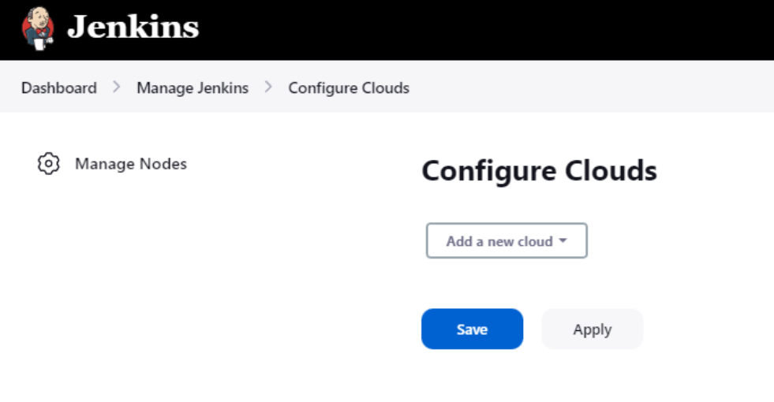
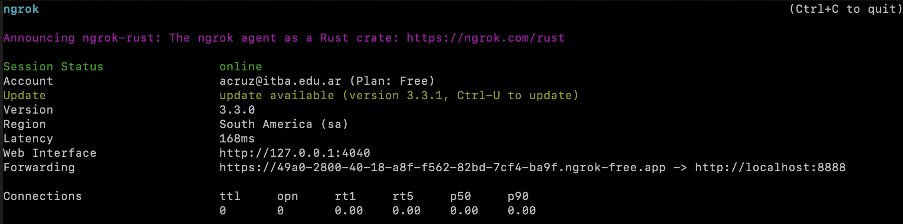
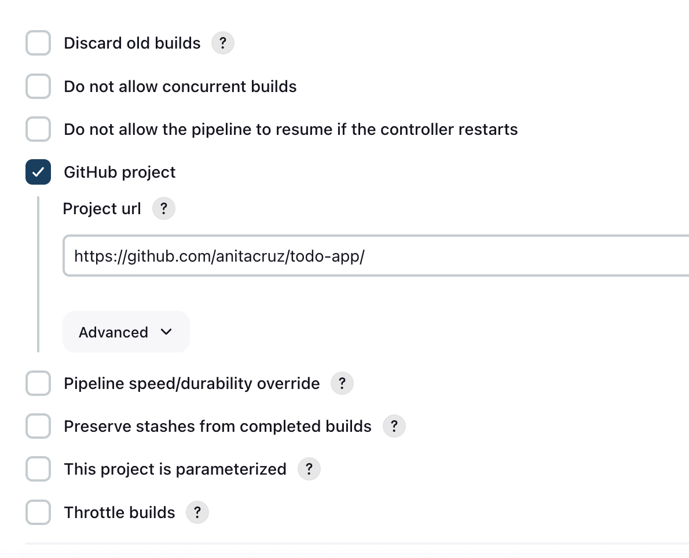

# Instructivo de instalación

## Instalación base de Jenkins
Decidimos correr Jenkins dentro de un contenedor de Docker. Sin embargo, en el futuro vamos a querer correr agentes Docker *dentro* del contenedor de Jenkins. Ahí es donde entra en juego Docker-in-Docker (DinD), que permite que el contenedor de Jenkins pueda levantar contenedores por sí mismo.

Para realizar la instalación base seguimos la [documentación oficial](https://www.jenkins.io/doc/book/installing/docker/).

Primero debemos crear una imágen personalizada de jenkins-blueocean que tenga Docker instalado dentro. De esta manera, podremos correr comandos de Docker dentro del contenedor de Jenkins.

### Dockerfile
```
FROM jenkins/jenkins:2.387.3
USER root
RUN apt-get update && apt-get install -y lsb-release
RUN curl -fsSLo /usr/share/keyrings/docker-archive-keyring.asc \
  https://download.docker.com/linux/debian/gpg
RUN echo "deb [arch=$(dpkg --print-architecture) \
  signed-by=/usr/share/keyrings/docker-archive-keyring.asc] \
  https://download.docker.com/linux/debian \
  $(lsb_release -cs) stable" > /etc/apt/sources.list.d/docker.list
RUN apt-get update && apt-get install -y docker-ce-cli
USER jenkins
RUN jenkins-plugin-cli --plugins "blueocean docker-workflow"
```

Luego creamos un docker-compose.yml, donde vamos a configurar:
- Una red `jenkins`, donde estarán alojados los contenedores `jenkins-blueocean` y `jenkins-docker`, que corren la instancia de Jenkins y DinD respectivamente.
- El volúmen `jenkins-data`, que albergará los datos y configuraciones de nuestra instancia de Jenkins
- El volúmen `docker-certs`, que albergará los certificados TLS que usaremos para verificarnos cuando querramos correr comandos usando DinD
- `jenkins-blueocean`, el contenedor que albergará la instancia de Jenkins
- `jenkins-docker`, el contenedor que albergará el servicio de DinD

### Docker compose
```yml
version: "3.8"

networks:
  jenkins:
    internal: false

services:
  jenkins-docker:
    container_name: jenkins-docker
    image: docker:dind
    privileged: true
    command: --storage-driver=overlay2
    networks:
      jenkins:
        aliases:
        - docker
    environment:
      - DOCKER_TLS_CERDIR=/certs
    volumes:
      - jenkins-docker-certs:/certs/client
      - jenkins-data:/var/jenkins_home
    ports: 
      - 2376:2376

  jenkins-blueocean:
    container_name: jenkins-blueocean
    build: 
      context: .
      dockerfile: Dockerfile
      tags:
      - myjenkins-blueocean:2.387.3-1
    ports:
      - 8888:8080
      - 50000:50000
    restart: on-failure
    networks:
      - jenkins
    environment:
      - DOCKER_HOST=tcp://docker:2376
      - DOCKER_CERT_PATH=/certs/client
      - DOCKER_TLS_VERIFY=1
    volumes:
      - jenkins-data:/var/jenkins_home
      - jenkins-docker-certs:/certs/client:ro

volumes:
  jenkins-data:
  jenkins-docker-certs:
```

Ahora, para levantar el servicio de Jenkins completo podemos simplemente correr
`docker-compose run -d` en el directorio que albergue al `docker-compose.yml` y el `Dockerfile`. Esto va a dejar accesible a la instancia de Jenkins en `http://localhost:8888`. Para continuar con la configuración, acceder al dominio mediante un buscador.

### Desbloquear Jenkins
La primera vez que iniciamos sesión en Jenkins, vamos a encontrarnos con esta pantalla:


Para desbloquear Jenkins, debemos obtener la contraseña de la consola del contenedor de Jenkins. Para esto, corremos `docker exec -it jenkins-blueocean cat /var/jenkins_home/secrets/initialAdminPassword`, copiamos la contraseña que nos devuelve y la ingresamos como la contraseña de nuestro admin.

### Instalar plugins
Luego, vamos a instalar los plugins que vamos a necesitar para el proyecto. Para esto, seleccionamos la opción `Install suggested plugins`.


### Crear usuario
No vamos a crear un usuario custom, sino que continuaremos con el usuario administrador. Tocar la opción `Continue as administrator`.

### Configurar Jenkins URL
Vamos a dejar la URL de Jenkins como la default, `http://localhost:8888/`. Tocar la opción `Save and Finish`. Como último paso, vamos a tener que reiniciar Jenkins para cargar los plugins intalados.

### Iniciar sesión
Vamos a iniciar sesión con las credenciales del usuario administrador que creamos.

## Configurar los agentes

### Instalar Docker Plugin
Para correr las tareas de buildeo, queremos que Jenkins utilice agentes dockerizados. Para lograr eso, primero debemos instalar el plugin `Docker` desde `Manage Jenkins > Manage Plugins`. 
Luego, vamos a crear un agente del tipo Cloud navegando hasta `Manage Jenkins > Manage Nodes > Configure Clouds`. 


### Configurar el certificado TLS
Aquí vamos a tener que configurar nuestro agente, primero creando una conexión a docker. Para esto, tocamos el botón `Add a new cloud` y seleccionamos `Docker`. Luego, debemos configurar los certificados TLS que vamos a usar para conectarnos con el contenedor DinD. Para esto, vamos a hacer uso del volúmen `docker-certs` que creamos en el `docker-compose.yml` y los certificados de Jenkins. Primero vamos a configurar el `Docker Host URI` con `tcp://docker:2376`.

Luego vamos a tener que recuperar nuestros certificados. Esto se logra corriendo los siguientes comandos:
```bash
docker exec jenkins-docker cat /certs/client/key.pem
docker exec jenkins-docker cat /certs/client/cert.pem
docker exec jenkins-docker cat /certs/server/ca.pem
```

Luego, debemos pulsar `Add credentials`, donde vamos a ingresar los certificados que acabamos de recuperar. Vamos a crear una nueva credencial del tipo `X.509 Client Certificate`. Para el campo `ID` vamos a usar `jenkins-docker-certs`. Para el campo `Description` vamos a usar `Docker TLS certificates`. Para el campo `Private Key`, vamos a ingresar el contenido de `key.pem`. Para el campo `Certificate`, vamos a ingresar el contenido de `cert.pem`. Para el campo `CA Certificate`, vamos a ingresar el contenido de `ca.pem`. Finalmente, vamos a pulsar `Add`.

### Crear el template
Ahora vamos a crear el template para nuestro agente. Para esto, vamos a pulsar `Add a new template` y vamos a ingresar la siguiente configuración:
- `Labels`: `docker-agent-node`
- `Name`: `docker-agent-node`
- `Docker Image`: `vriera/agent-node`
- `Instance Capacity`: 2
- `Remote File System Root`: `/home/jenkins`

Utilizamos una imágen personalizada de Docker que contiene NodeJS y Yarn. Esta imágen se encuentra en [Docker Hub](https://hub.docker.com/r/vriera/agent-node). 

## Crear un pipeline
Luego de configurar los agentes, vamos a crear un pipeline para nuestro proyecto. Para esto, vamos a pulsar `New Item` y vamos a ingresar el nombre del pipeline. Luego, vamos a seleccionar `Pipeline` y vamos a pulsar `OK`. 

En la sección `Pipeline`, vamos a seleccionar `Pipeline script from SCM` y vamos a ingresar la URL del repositorio. En este caso, vamos a usar `https://github.com/szavalia/tpe-redes-g11` y apuntar el `Jenkins Script` a `jenkins/Jenkinsfile`.

## Configurar el webhook
Ahora vamos a configurar el pipeline para que pueda detectar cambios con el webhook. Para esto, primero debemos configurar un sistema de forwarding que permita que nuestro servidor de Jenkins sea accesible desde internet. Para esto, vamos a usar [ngrok](https://ngrok.com/). 
  Ngrok es una herramienta que nos permite crear tuneles desde una red publica a un servidor local. Esto nos permite agregar conectividad de manera segura, y así es como exponemos una dirección de Jenkins para que github pueda hacerle llamados. Como Jenkins corre en el puerto 8888, quiero exponer ese puerto usando ngrok, y lo hago de la siguiente manera: 

  ```bash
  ngrok http 8888
  ```

Aquí voy a tener una ventana que muestre la configuración de ngrok, por ejemplo: 

De esto nos interesa tomar cual es la *web interface* que nos dá, el link de https://49a0... que es el que expone a Jenkins. Primero voy a asegurarme que Jenkins esté al tanto de que este es el link con el que tiene que identificarse. Esto lo hago yendo a `Manage Jenkins > Configure System `y ahí bajo el titulo `Jenkins Location` alterar el `Jenkins URL` pegando el valor de ngrok. 

Ahora Establezcamos la conexión desde github. En el repositorio que quiero buildear con mi pipeline voy a `Settings > Code and Automations: Webhooks`. Ahí decido agregar un webhook. Voy a pegar el link nuevamente de ngrok pero agregandole al final `/github-webhook/ ` textual. Para el campo del secret voy nuevamente a Jenkins, en el dropdown arriba a la derecha donde está el nombre del usuario presiono la flecha y entro a `Configure`.  En la seccion de `Api Token ` Genero un nuevo token con un nombre que me resulte significativo y copio el valor. Cuidado que si no lo hacemos ahora no lo podremos copiar despues! Volvemos a github y pegamos el secreto. Nos aseguramos que el content type sea `application/JSON` y tocamos aceptar. 

Por ultimo, queremos que el pipeline sepa que va a estar esperando actualizaciones de este repositorio, así que vamos a la configuración del pipeline y le indicamos que su contenido viene de un repositorio de la siguiente manera: 

Naturalmente cambiamos en link al repositorio con el que sea que estamos utilizando y listo, El webhook debería desencadenar un nuevo build. 


